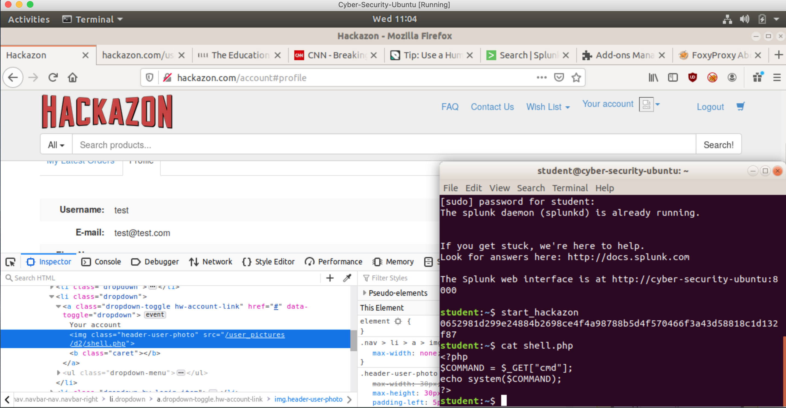
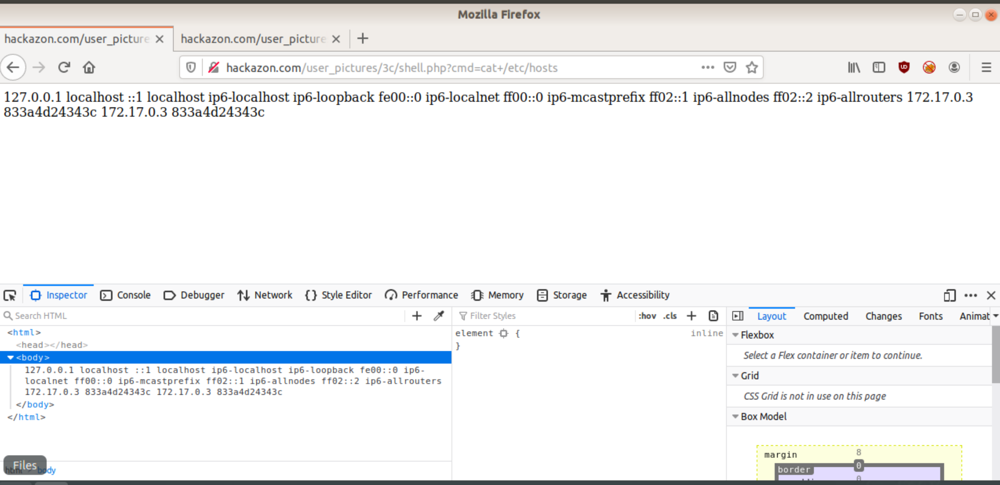
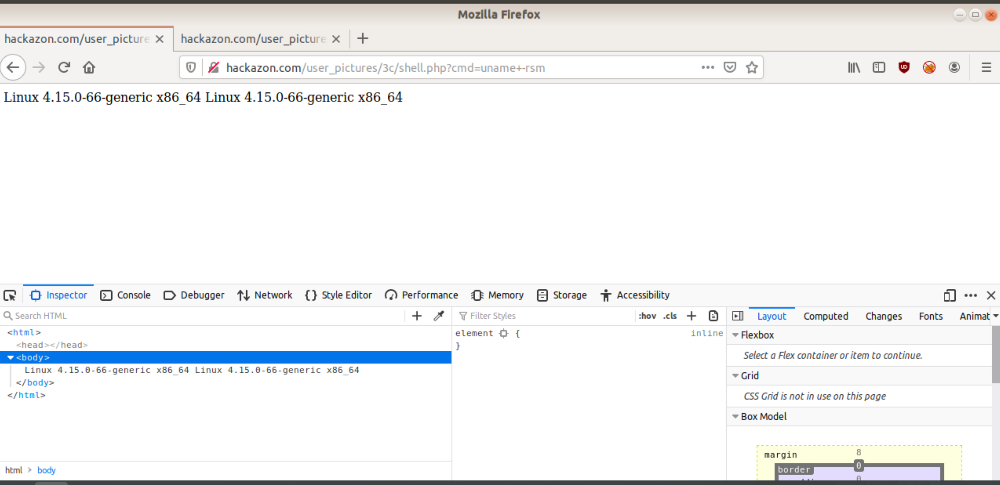
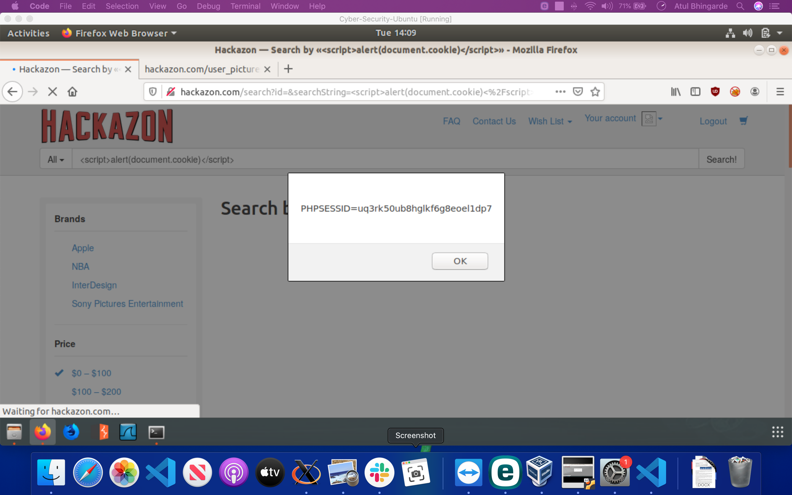

# Web Vulnerabilities Homework Week 2 

Over the past two weeks, you've studied the most important vulnerabilities in OWASP:
- Cross-Site Scripting (XSS)
- SQL Injection
- Command Injection
- Local and Remote File Inclusion
- File Upload Vulnerabilities

This weeks homework will be a review for web vulnerabilities week two. Specifically the homework will be segmented into three parts:
- Part 1: Local File Inclusion 
- Part 2: Command Injection
- Part 3: Cross Site Scripting (XSS)

**Scenario:**

The homework scenario is **a penetration test for an online retailer**. You will be completing three exercises, in order to accomplish this. 

**Lab Environment**

- [Run Me](run_me)
- [Dependencies](dependencies)

You will only need to run the **run_me** script, as it will run the dependencies script for you. The run_me script is the only script that needs to be ran. 

To run the script you will need to do the following
- Download the script onto your VM.
- Change the permissions by running `chmod +x run_me && chmod +x dependencies`
- Run the script `./script`. 

If you are using VMware, run the following commands:
- `sudo rm -rf /var/lib/apt/lists/*`
- `sudo apt-get clean`
- `sudo apt-get update`
- `chmod +x run_me && chmod +x dependencies`
- `./script`. 

- After running this script, you will be able to navigate to hackazon by typing into the url bar `hackazon.com`, and DVWA by typing `dvwa.com`. 

**Note** if your machine restarts you'll need to turn DVWA and Hackazon back on by entering the following commands:

- `/usr/local/bin/start_dvwa`
- `/usr/local/bin/start_hackazon`

---

## Part 1: Local File Inclusion

The local file inclusion is done using the `shell.php` that is added as a profile picture and it is used further for executing local commands as well.

**Scenario:**

Recently your company was hired to pentest a online retailer called Hackazon.com. The Hackazon IT department have received tips that employees have been able to access their colleagues data through URL manipulation. Hackazon has asked that you and you team verify these claims before the make any updates to their website. Your job is to use LFI to see if you can access any confidential information on the server. 

**Instructions:**

- Before you begin, click in the upper right hand corner and login using the username `admin` and the password you set up for the MySQL database.
- Click on `My Documents` then click on any documents from the list. 
- Using **only** the LFI techniques that you have learned this past week, see if you can read the following confidential information from the server:
  - The `/etc/hosts` file
  - The `/etc/passwd` file
  
- - -  

## Part 2: Command Injection 

**Scenario:**

Because the server is vulnerable to navigation via shell code, we might be able to send commands to the server and have it process them. If this is true, it will put the employees confidential information at risk. Because of this risk, Hackazon has asked you to test for command injection vulnerabilities. 

**Instructions:**

- Before you begin, click in the upper right hand corner and login using the username `admin` and the password you set up for the MySQL database.
- Click on `My Documents` then any attached document.
- Using **only** the command injection techniques that you have learned this past week, see if you can read the following information from the server: 
  - The `/etc/hosts` file
  
  - The `/etc/passwd` file
  

In addition to finding those files on the server, see if you can find information about the server itself. Specifically:

- All the groups on the server

- The Kernel

- Any cronjobs they may have

- - -

## Part 3: Manually preforming XSS (0:10)

**Scenario:**

Vulnerability to command injection would suggest other injection vulnerabilities such as cross-site-scripting (XSS). Because we verified that command injection attacks is an issue, the next step would be to see if we could inject our own code to access other confidential information located onto the Hackazon server. 

**Instructions:**

- Find an injection point
- Inject the characters
- Send the payload

Emphasize again that these steps are similar to LFI, and Command injection because they are injection vulnerabilities. 

**Challenge:**

Cause an alert to pop up with the users cookie using XSS

**Good luck!**
